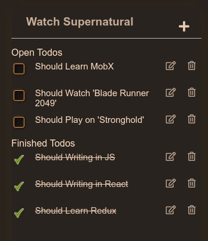

# React Mobx Examples

These are the sample code for `mobx 6`.
If my work is useful to you, I will be glad.
Enjoy!

## mini-examples

Small code examples for working with mobx

## TodoList

* The `context` is used to get the data.
* Adding a new record from input at the top.
* Sorting records by completed and not completed.
* Editing and Deleting
* All inputs respond to the Enter button to save the data.

